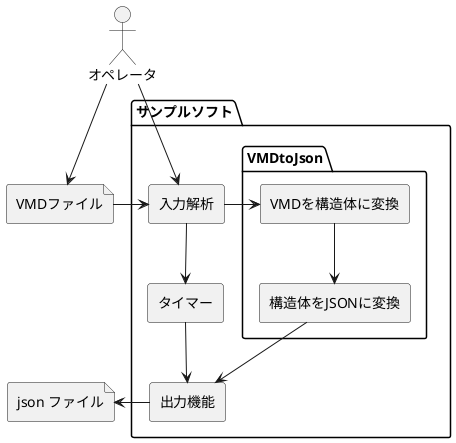

# VMD to JSON

MikuMikuDance(以下,MMD) のモーションデータ保存形式であるVMDのファイルをJSON形式に変換するコンバーダーです。

## コマンド

| コマンド                              | コマンドの略称前       | 動作                                                                     |
|:--------------------------------------|:-----------------------|--------------------------------------------------------------------------|
| -h/-H                                 | **h**elp               | コマンド情報を表示する                                                   |
| -F [変換したいVMDファイル]            | input **f**ile         | 変換したVMDファイルを指定する。                                          |
| -O [出力するファイルパス]             | **o**utput file        | 出力したJSONのファイルを指定する。                                       |
| -S [開始位置を設定したいフレーム番号] | **s**tart frame number | VMDファイルは0フレームから開始するので指定したフレーム数追加値で出力する |
| -M                                    | **m**inimum json       | データサイズを小さくしたい場合用の改行がないJsonにする                   |
| -T [ターゲットID]                     | **t**arget ID          | どのモデルに対しての操作か変わりやすいようにIDを付与が可能               |
| -q                                    | **q**uit               | 動作ログをださない                                                       |

[T.B.D.] 実装検討中
| コマンド                                 |     コマンドの略称前      | 動作                                                                               |
|:-----------------------------------------|:-------------------------:|------------------------------------------------------------------------------------|
| -C [開始フレーム番号] [終了フレーム番号] |          **c**ut          | 指定したフレーム番号の範囲のみ出力する                                             |
| -p [ポート番号]                          |         **p**ort          | Jsonを飛ばすポート番号                                                             |
| -r                                       |        **r**epeart        | 出力を繰り返す                                                                     |
| -i [送信間隔 [ms]] [切り出しフレーム数]  | Transmission **i**nterval | ファイルサイズが大きい場合に、一定間隔でフレームを切り出したデータだけを送信する。 |

## ソフトウェアの構造

