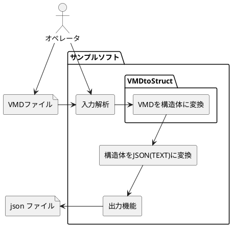

# VMD to JSON

MikuMikuDance(以下,MMD) のモーションデータ保存形式であるVMDのファイルをJSON形式に変換するコンバーダーです。


## 使い方

コマンドプロンプトで、下記のようにするとJsonファイルを出力出来ます。

``` cmd
VMDtoJson -F [変換したいVMDファイル] -O [出力するファイルパス]
```

これ以外にもコマンドを設定することで出力ファイルの結果に対して操作ができます。


### コマンド


| コマンド                              | コマンドの略称前       | 動作                                                                                |
| :------------------------------------ | :--------------------- | ----------------------------------------------------------------------------------- |
| -h/-H                                 | **h**elp               | コマンド情報を表示する                                                              |
| -F [変換したいVMDファイル]            | input **f**ile         | 変換したVMDファイルを指定する。                                                     |
| -O [出力するファイルパス]             | **o**utput file        | 出力したJSONのファイルを指定する。                                                  |
| -S [開始位置を設定したいフレーム番号] | **s**tart frame number | VMDファイルは0フレームから開始するので指定したフレーム数追加値で出力する            |
| -M                                    | **m**inimum json       | データサイズを小さくしたい場合用の改行がないJsonにする                              |
| -T [ターゲットID]                     | **t**arget ID          | どのモデルに対しての操作か変わりやすいようにIDを付与が可能                          |
| -q                                    | **q**uit               | 動作ログを出力しない                                                                |
| --LeftHand                            | Left Hand              | 座標を左手系に変更する。(デフォルト)                                                |
| --RightHand                           | Right Hand             | 座標を右手系に変更する。 [--LeftHand] が指定されていると無効になります。            |
| --MMDtHand                            | MMD Hand               | MMD座標に変更する。 [--LeftHand ｜--RightHand  ] が指定されていると無効になります。 |
| -G [ NONE / NAME ]                    | Group by *             | モーションの並び順をMMD(時系列：デフォルト)か パーツ名で一回グルーピングする        |


## ソフトウェアの構造



